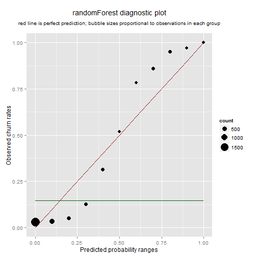

## Three customer churn models


I'm trying to replicate in R some models originally written in Python by Eric Chiang of $\hat{y}hat$ and [published on the company blog not too long ago](http://blog.yhathq.com/posts/predicting-customer-churn-with-sklearn.html).

We have `nrow(X)` cell phone customers with some usage data, some churned, some not, and we'll try to guess the best we can who churns and who doesn't. We will be using a support vector classifier (SVM), a random forest (rF), and a k nearest neighbor classifier (KNN), then we will compare their performance.

The timing for this blog post is perfect. It is of interest for me at work right now, and I also have the secondary goal of getting myself some GitHub practice, because I am scheduled to give my coworkers an introduction to our GitHub enterprise account soon. If I make it look easy, they might take to it.

So I cloned [Eric's code](https://github.com/EricChiang/churn) and got to work. My approximation of how his three models might be done in R is shown below. I define three functions for the job: `modelBakeoff()`, `groupThese()` and `summarizeThese()`. The last one does the work that Eric relegated to the `churn_measurements.py` script. You will want to see his comments and citations.


```r
# compare 3 classifiers with k-fold cross-validation
modelBakeOff <- function(k = 5) {
    dat <- data.frame(X.scaled, y = as.factor(y))
    set.seed(20140407)
    folds = sample(rep(1:k, length = nrow(dat)))
    
    # home of the accuracy rates
    acc <- matrix(NA, k, 3)
    
    # temporary homes of counts for confusion matrices
    cmsvm <- list()
    cmrf <- list()
    cmknn <- list()
    
    # temporary homes for probability tables
    probsvm <- list()
    probrf <- list()
    probknn <- list()
    
    # try some classifiers, as close as I can get them to sklearn defaults
    for (j in 1:k) {
        # SVM classifier
        svmfit <- svm(y ~ ., data = dat[folds != j, ], kernel = "radial", scale = FALSE, 
            probability = TRUE)
        svmprob <- predict(svmfit, newdata = dat[folds == j, ], probability = TRUE)
        acc[j, 1] <- sum(svmprob == dat[folds == j, ]$y)/nrow(dat[folds == j, 
            ])
        cmsvm[[j]] <- table(svmprob, dat[folds == j, ]$y)
        probsvm[[j]] <- cbind(as.logical(dat[folds == j, ]$y), as.logical(svmprob), 
            attr(svmprob, "probabilities")[, 2])
        
        # randomForest
        train <- folds != j
        rffit <- randomForest(y ~ ., data = dat, subset = train, ntree = 10)
        rfprob <- predict(rffit, dat[folds == j, ], type = "prob")
        acc[j, 2] <- sum((rfprob[, 2] > 0.5) == (as.logical(dat[folds == j, 
            ]$y)))/nrow(dat[folds == j, ])
        cmrf[[j]] <- table(rfprob[, 2] > 0.5, dat[folds == j, ]$y)
        probrf[[j]] <- cbind(as.logical(dat[folds == j, ]$y), rfprob[, 2] > 
            0.5, rfprob[, 2])
        
        # K-nearest neighbors
        knnfit <- knn(X.scaled[folds != j, ], X.scaled[folds == j, ], cl = factor(y)[folds != 
            j], k = 5, prob = TRUE)
        acc[j, 3] <- sum(knnfit == factor(y)[folds == j])/length(knnfit)
        cmknn[[j]] <- table(knnfit, dat[folds == j, ]$y)
        probknn[[j]] <- cbind(as.logical(dat[folds == j, ]$y), as.logical(knnfit), 
            attr(knnfit, "prob"))
    }
    colnames(acc) <- c("SVM", "rF", "KNN")
    
    # now add the k tables together for full cross-validated confusion matrices
    makeCM <- function(x) {
        out <- Reduce("+", x)
        dimnames(out)[[1]] <- paste("predicted", dimnames(out)[[1]], sep = ".")
        return(out)
    }
    cmsvm <- makeCM(cmsvm)
    cmrf <- makeCM(cmrf)
    cmknn <- makeCM(cmknn)
    
    # now rbind() together the k probability matrices for full cross-validated
    # probability estimates
    probsvm <- Reduce("rbind", probsvm)
    probrf <- Reduce("rbind", probrf)
    probknn <- Reduce("rbind", probknn)
    
    cm <- list(cmsvm, cmrf, cmknn)
    prob <- list(probsvm, probrf, probknn)
    names(cm) <- colnames(acc)
    names(prob) <- colnames(acc)
    
    out <- list(acc, cm, prob)
    names(out) <- c("CV Accuracy", "CV Confusion Matrices", "CV Probabilities")
    return(out)
}
bakeoff <- modelBakeOff()

# OK, so now I have predicted probabilities for everybody. Let's split data
# into groups corresponding to probability ranges.  This function takes a
# probability matrix (pm) as stored in the third element of the list that
# modelBakeoff() returns.  this will be useful for several things later:
groupThese <- function(pm, k = 10) {
    ranges <- c(0, c(1:k)/k)
    df <- data.frame(c(1:nrow(pm)), pm)
    names(df) <- c("id", "true.churn", "predicted.churn", "prob")
    df$group <- NA
    for (i in 1:k) {
        df$group[df$prob <= ranges[i + 1] & df$prob > ranges[i]] <- i
    }
    dt <- data.table(df)
    setkey(dt, group, id)
    return(dt)
}

# function below takes a data table as returned by groupThese().  it returns
# a list of three things: 1. summary -- a data table that summarizes
# frequency counts, empirical probabilities (true and predicted) within each
# bin of estimated probabilities.  2. cscore -- a calibration score 3.
# dscore -- a discrimination score
summarizeThese <- function(dt) {
    summary <- dt[, list(trueprobs = mean(true.churn), predprobs = mean(prob), 
        count = .N), by = list(group)]
    baseprob <- summary$predprobs %*% summary$count/sum(summary$count)
    cscore <- (summary$trueprobs - summary$predprobs)^2 %*% summary$count/sum(summary$count)
    dscore <- (summary$trueprobs - baseprob)^2 %*% summary$count/sum(summary$count)
    out <- list(summary, cscore, dscore)
    names(out) <- c("summary", "calibration", "discrimination")
    return(out)
}

svmsum <- summarizeThese(groupThese(bakeoff[[3]][["SVM"]]))
rfsum <- summarizeThese(groupThese(bakeoff[[3]][["rF"]]))
knnsum <- summarizeThese(groupThese(bakeoff[[3]][["KNN"]]))
```


First, Eric shows a comparison of overall accuracy rates, then some confusion matrices in colorful graph format. Mine are below (with confusion matrices in plain text, good enough for right now):


```
[1] ""
```

```
[1] "Cross-validated accuracy rates"
```

```
   SVM     rF    KNN 
0.9202 0.9442 0.8923 
```

```
[1] ""
```

```
[1] "Cross-validated confusion matrices"
```

```
$SVM
                 
svmprob           FALSE TRUE
  predicted.FALSE  2784  200
  predicted.TRUE     66  283

$rF
                 
                  FALSE TRUE
  predicted.FALSE  2820  156
  predicted.TRUE     30  327

$KNN
                 
knnfit            FALSE TRUE
  predicted.FALSE  2801  310
  predicted.TRUE     49  173
```


My numbers are close enough to his so far. Next, some pictures:


  


The calibration and discrimination scores matter because they measure how close overall your bubbles are to your red lines. Obviously, the closer the better and bubble sizes matter. The classification and discrimination scores are essentially average squared distances weighted by bubble size.

Lower calibration is better, and higher discrimination is better. There's more detail in the original post. For now, here are mine:


```
                 SVM    rF   KNN
Calibration    0.001 0.006 0.685
Discrimination 0.067 0.078 0.620
```


You will notice that my KNN scores are both entirely out of whack. Clearly, my attempt to replicate the defaults of `KNeighborsClassifier` in `sklearn.neighbors` failed miserably. But I did pretty well with the support vector classifier and the random forest, so I won't feel too bad. 

I concur with Eric that SVM beats rF on calibration, and rF beats SVM on discrimination, so the jury's still out. Just by eyeballing the two pictures above, my vote would go to SVM. I don't like that S pattern in rF. However, a comparison of the confusion matrices would endorse rF clearly. Both numbers on the main diagonal are larger in rF than they are in SVM.

My code is on [GitHub](https://github.com/ghuiber/churn/tree/Rversion). Fork it and let me know if you figured out how I managed to be so off on KNN. 
