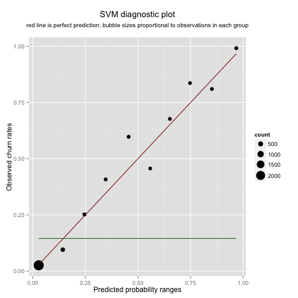
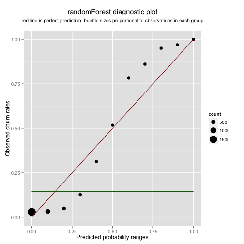

## Three customer churn models


I'm trying to replicate in R some models originally written in Python by Eric Chiang of $\hat{y}hat$ and [published on the company blog not too long ago](http://blog.yhathq.com/posts/predicting-customer-churn-with-sklearn.html).

I have 3,333 cell phone customers with some usage data, some churned, some not, and I will try to guess the best I can who churns and who doesn't. Like Eric, I will be using a support vector classifier (SVM), a random forest (rF), and a k nearest neighbor classifier (KNN), then I will compare their performance.

The timing for Eric's blog post is perfect. The topic is of interest to me at work right now, and I also have the secondary goal of getting some GitHub practice. I am scheduled to give my coworkers an introduction to our GitHub enterprise account soon. If I make it look easy, they might take to it. If it turns out to actually be easy, this time around I might take to it myself (my earlier forays into version control have failed to turn into working habits, unfortunately). 

This little project will be a good test case for a few common things one would do with Git: starting a local repository -- initiated or cloned -- adding and editing files, committing the changes, and then pushing them to possibly more than one remote repository. In this case, I am making the code and these notes public but I also want them available on the enterprise repository.

So I cloned [Eric's code](https://github.com/EricChiang/churn) and got to work. My approximation of how his three models might be done in R is shown below. I define three functions for the job: `modelBakeOff()`, `groupThese()` and `summarizeThese()`. The last one does the work that Eric relegated to the `churn_measurements.py` script. You will want to see his comments and citations.


```r
# compare 3 classifiers with k-fold cross-validation
modelBakeOff <- function(k = 5) {
    dat <- data.frame(X.scaled, y = as.factor(y))
    set.seed(20140407)
    folds = sample(rep(1:k, length = nrow(dat)))
    
    # home of the accuracy rates
    acc <- matrix(NA, k, 3)
    
    # temporary homes of counts for confusion matrices
    cmsvm <- list()
    cmrf <- list()
    cmknn <- list()
    
    # temporary homes for probability tables
    probsvm <- list()
    probrf <- list()
    probknn <- list()
    
    # try some classifiers, as close as I can get them to sklearn defaults
    for (j in 1:k) {
        # SVM classifier
        svmfit <- svm(y ~ ., data = dat[folds != j, ], kernel = "radial", scale = FALSE, 
            probability = TRUE)
        svmprob <- predict(svmfit, newdata = dat[folds == j, ], probability = TRUE)
        acc[j, 1] <- sum(svmprob == dat[folds == j, ]$y)/nrow(dat[folds == j, 
            ])
        cmsvm[[j]] <- table(svmprob, dat[folds == j, ]$y)
        probsvm[[j]] <- cbind(as.logical(dat[folds == j, ]$y), as.logical(svmprob), 
            attr(svmprob, "probabilities")[, 2])
        
        # randomForest
        train <- folds != j
        rffit <- randomForest(y ~ ., data = dat, subset = train, ntree = 10)
        rfprob <- predict(rffit, dat[folds == j, ], type = "prob")
        acc[j, 2] <- sum((rfprob[, 2] > 0.5) == (as.logical(dat[folds == j, 
            ]$y)))/nrow(dat[folds == j, ])
        cmrf[[j]] <- table(rfprob[, 2] > 0.5, dat[folds == j, ]$y)
        probrf[[j]] <- cbind(as.logical(dat[folds == j, ]$y), rfprob[, 2] > 
            0.5, rfprob[, 2])
        
        # K-nearest neighbors
        knnfit <- knn(X.scaled[folds != j, ], X.scaled[folds == j, ], cl = factor(y)[folds != 
            j], k = 5, prob = TRUE)
        acc[j, 3] <- sum(knnfit == factor(y)[folds == j])/length(knnfit)
        cmknn[[j]] <- table(knnfit, dat[folds == j, ]$y)
        probknn[[j]] <- cbind(as.logical(dat[folds == j, ]$y), as.logical(knnfit), 
            attr(knnfit, "prob"))
    }
    colnames(acc) <- c("SVM", "rF", "KNN")
    
    # now add the k tables together for full cross-validated confusion matrices
    makeCM <- function(x) {
        out <- Reduce("+", x)
        dimnames(out)[[1]] <- paste("predicted", dimnames(out)[[1]], sep = ".")
        return(out)
    }
    cmsvm <- makeCM(cmsvm)
    cmrf <- makeCM(cmrf)
    cmknn <- makeCM(cmknn)
    
    # now rbind() together the k probability matrices for full cross-validated
    # probability estimates
    probsvm <- Reduce("rbind", probsvm)
    probrf <- Reduce("rbind", probrf)
    probknn <- Reduce("rbind", probknn)
    
    cm <- list(cmsvm, cmrf, cmknn)
    prob <- list(probsvm, probrf, probknn)
    names(cm) <- colnames(acc)
    names(prob) <- colnames(acc)
    
    out <- list(acc, cm, prob)
    names(out) <- c("CV Accuracy", "CV Confusion Matrices", "CV Probabilities")
    return(out)
}
bakeoff <- modelBakeOff()

# OK, so now I have predicted probabilities for everybody. Let's split data
# into groups corresponding to probability ranges.  This function takes a
# probability matrix (pm) as stored in the third element of the list that
# modelBakeoff() returns.  this will be useful for several things later:
groupThese <- function(pm, k = 10) {
    ranges <- c(0, c(1:k)/k)
    df <- data.frame(c(1:nrow(pm)), pm)
    names(df) <- c("id", "true.churn", "predicted.churn", "prob")
    df$group <- NA
    for (i in 1:k) {
        df$group[df$prob <= ranges[i + 1] & df$prob > ranges[i]] <- i
    }
    dt <- data.table(df)
    setkey(dt, group, id)
    return(dt)
}

# function below takes a data table as returned by groupThese().  it returns
# a list of three things: 1. summary -- a data table that summarizes
# frequency counts, empirical probabilities (true and predicted) within each
# bin of estimated probabilities.  2. cscore -- a calibration score 3.
# dscore -- a discrimination score
summarizeThese <- function(dt) {
    summary <- dt[, list(trueprobs = mean(true.churn), predprobs = mean(prob), 
        count = .N), by = list(group)]
    baseprob <- summary$trueprobs %*% summary$count/sum(summary$count)
    cscore <- (summary$trueprobs - summary$predprobs)^2 %*% summary$count/sum(summary$count)
    dscore <- (summary$trueprobs - baseprob)^2 %*% summary$count/sum(summary$count)
    out <- list(summary, cscore, dscore)
    names(out) <- c("summary", "calibration", "discrimination")
    return(out)
}

svmsum <- summarizeThese(groupThese(bakeoff[[3]][["SVM"]]))
rfsum <- summarizeThese(groupThese(bakeoff[[3]][["rF"]]))
knnsum <- summarizeThese(groupThese(bakeoff[[3]][["KNN"]]))
```


First, Eric shows a comparison of overall accuracy rates, then some confusion matrices in colorful graph format. Mine are below -- with confusion matrices in plain text, good enough for right now.

Cross-validated accuracy rates:

```
  SVM    rF   KNN 
0.920 0.944 0.892 
```


Cross-validated confusion matrices:

```
$SVM
                 
svmprob           FALSE TRUE
  predicted.FALSE  2784  200
  predicted.TRUE     66  283

$rF
                 
                  FALSE TRUE
  predicted.FALSE  2820  156
  predicted.TRUE     30  327

$KNN
                 
knnfit            FALSE TRUE
  predicted.FALSE  2801  310
  predicted.TRUE     49  173
```


My numbers are close enough to his so far. Next, some pictures:


  


The calibration scores measure how close overall the bubbles are to the diagonal red lines. Obviously, the closer the better and bubble sizes matter. The discrimination scores measure how far overall the bubbles are from the horizontal green lines, which just show the mean churn rate for the entire population. Here too bubble sizes matter. Both scores are essentially average squared distances weighted by bubble size.

Lower calibration is better, and higher discrimination is better. There's more detail in the original post. For now, here are my scores:


```
                 SVM    rF   KNN
Calibration    0.001 0.006 0.685
Discrimination 0.067 0.078 0.029
```


You will notice that my KNN calibration score is off. Clearly, my attempt to replicate the defaults of `KNeighborsClassifier` in `sklearn.neighbors` failed miserably. The documentation for `FNN::knn` says that when you call `knn()` with `prob=TRUE` the majority vote is a proxy for probability. This might work better with a larger number of neighbors considered. But I came pretty close to Eric's numbers with SVM and rF, so I won't feel too bad. 

I agree with Eric that SVM beats rF on calibration, but rF both beats SVM on discrimination and shows a better confusion matrix, with both numbers on the main diagonal larger than their SVM counterparts. So, I'd favor rF. The only thing I don't like about it is that S pattern in the rF picture. If you think of the distances between the bubbles and the red diagonal as errors, you'd want them to be random. 

My code is on [GitHub](https://github.com/ghuiber/churn/tree/Rversion). Fork it and let me know if you figure out what I messed up on the KNN calibration. Here's my session info:


```
R version 3.0.3 (2014-03-06)
Platform: x86_64-w64-mingw32/x64 (64-bit)

locale:
[1] LC_COLLATE=English_United States.1252 
[2] LC_CTYPE=English_United States.1252   
[3] LC_MONETARY=English_United States.1252
[4] LC_NUMERIC=C                          
[5] LC_TIME=English_United States.1252    

attached base packages:
[1] grid      stats     graphics  grDevices utils     datasets  methods  
[8] base     

other attached packages:
[1] data.table_1.9.2   randomForest_4.6-7 FNN_1.1           
[4] e1071_1.6-3        ggplot2_0.9.3.1    gridExtra_0.9.1   
[7] knitr_1.5         

loaded via a namespace (and not attached):
 [1] class_7.3-9        colorspace_1.2-4   dichromat_2.0-0   
 [4] digest_0.6.4       evaluate_0.5.1     formatR_0.10      
 [7] gtable_0.1.2       labeling_0.2       MASS_7.3-30       
[10] munsell_0.4.2      plyr_1.8.1         proto_0.3-10      
[13] RColorBrewer_1.0-5 Rcpp_0.11.1        reshape2_1.2.2    
[16] scales_0.2.3       stringr_0.6.2      tools_3.0.3       
```

